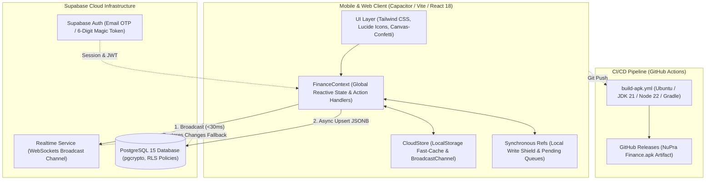
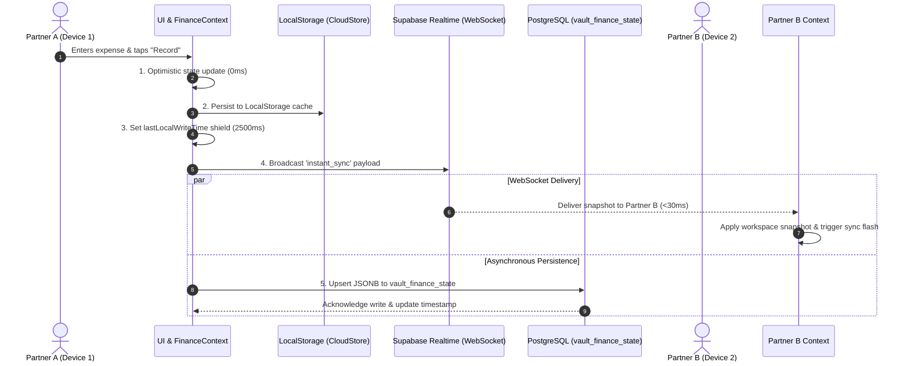
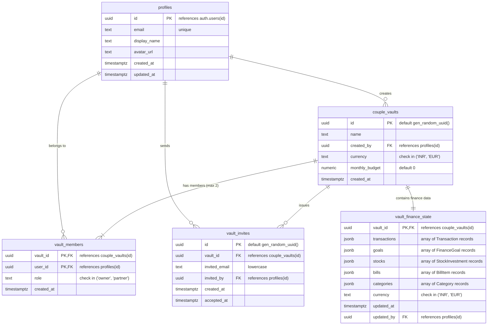

# NuPra Finance — Technical Implementation & Architecture Specification

---

## 1. System Overview & Core Principles

NuPra Finance is a collaborative personal and couple finance tracking application engineered for high-performance mobile (Android via Capacitor) and web platforms. The platform allows couples and individuals to maintain combined and personal ledgers with zero latency, complete transparency, strict isolation, and real-time synchronization.

### Guiding Principles

1. **Zero-Latency Optimistic UI (0ms)**: Every user action (logging an expense, toggling a flag, adding a comment, or creating a category) updates in-memory React state and local persistent storage (`CloudStore`) synchronously before any network round-trip.
2. **Sub-30ms Realtime Partner Broadcast**: State changes are broadcast across devices using Supabase Realtime WebSockets directly on a dedicated channel (`vault-state:<vaultId>`) before/alongside database persistence.
3. **Strict Two-Member Vault Security & Isolation**: PostgreSQL Row Level Security (RLS) policies and security-definer stored procedures ensure a couple vault strictly accommodates at most two authenticated partner accounts. No user can view or mutate data outside their vault.
4. **Mutual Read-Only Protection with Active Collaboration**: Neither partner can edit or delete financial transactions recorded by the other partner. However, both partners can flag transactions for review and converse in an inline discussion thread.
5. **Conflict-Free Union Reconciliation**: Categories and local creations are reconciled using deterministic union merging and pending creation queues, preventing offline or race-condition data loss.

---

## 2. System Architecture & Component Diagram

### 2.1 High-Level Architecture



### 2.2 Data Synchronization Sequence

The following sequence illustrates what happens when Partner A logs an expense or flags a transaction:



---

## 3. Database Architecture & Schema (PostgreSQL)

The database schema is implemented in [`supabase/migrations/20260925000100_couple_finance.sql`](supabase/migrations/20260925000100_couple_finance.sql).

### 3.1 Entity Relationship Diagram (ERD)



### 3.2 Table Specifications

1. **`public.profiles`**:
   - Extends Supabase `auth.users`.
   - Stores display name, email, and avatar URL.
   - Enforced by RLS: a user can only edit their own profile, and can only read profiles of users who share a mutual vault.

2. **`public.couple_vaults`**:
   - Represents the shared ledger workspace between two partners.
   - Stores currency preference (`INR` or `EUR`) and primary monthly budget target.

3. **`public.vault_members`**:
   - Enforces the 2-member limit using a unique index (`one_vault_per_user` on `user_id`).
   - Assigns role: `'owner'` (creator) or `'partner'` (invitee).

4. **`public.vault_invites`**:
   - Handles partner linking via email.
   - Enforces single pending invite per vault (`one_pending_invite_per_vault` unique index where `accepted_at is null`).
   - Case-insensitive email validation (`constraint vault_invites_email_lower check (invited_email = lower(invited_email))`).

5. **`public.vault_finance_state`**:
   - Single-row document store per vault containing `transactions`, `goals`, `stocks`, `bills`, and `categories` as structured JSONB columns.
   - Provides ultra-fast reads (1 query fetches entire ledger state) and prevents database schema migration downtime for client feature extensions.
   - Published to `supabase_realtime` publication for instant CDC events.

### 3.3 Security & Stored Procedures (RPCs)

All multi-table mutations are encapsulated inside PostgreSQL security-definer stored procedures (`set search_path = ''` to prevent search path injection):

- **`create_couple_vault(p_name, p_currency, p_monthly_budget)`**:
  - Validates confirmed email address.
  - Ensures user is not already bound to another vault.
  - Inserts `couple_vaults`, `vault_members` (as `'owner'`), and initializes empty `vault_finance_state` atomically.
- **`create_partner_invite(p_vault_id, p_email)`**:
  - Enforces that only the vault owner can invite a partner.
  - Enforces that the vault currently has exactly 1 member.
  - Precludes self-invitation or duplicate pending invites.
- **`accept_partner_invite(p_invite_id)`**:
  - Enforces that `auth.jwt() ->> 'email'` matches `invited_email`.
  - Enforces that total vault members count is strictly less than 2 before insertion.
  - Marks invite accepted and adds the invitee to `vault_members` as `'partner'`.

### 3.4 Row Level Security (RLS) Model

The migration enables RLS on all tables and strictly restricts access:

```sql
-- Helper function to verify membership
create or replace function private.is_vault_member(p_vault_id uuid)
returns boolean language sql stable security definer as $$
  select exists (
    select 1 from public.vault_members m
    where m.vault_id = p_vault_id and m.user_id = (select auth.uid())
  );
$$;
```

Policies:
- `vault_finance_state_select_members`: `private.is_vault_member(vault_id)`
- `vault_finance_state_insert_members`: `private.is_vault_member(vault_id)`
- `vault_finance_state_update_members`: `private.is_vault_member(vault_id)`

---

## 4. Backend & Real-Time Synchronization Engine

The synchronization engine in [`src/context/FinanceContext.tsx`](src/context/FinanceContext.tsx) and [`src/services/supabaseFinance.ts`](src/services/supabaseFinance.ts) balances zero latency on mobile with data durability in the cloud.

### 4.1 Hybrid Real-Time & Polling Architecture

1. **Primary Transport — WebSocket Broadcast**:
   - Uses Supabase Realtime channel `vault-state:<vaultId>`.
   - Sends payload with `{ snapshot, senderId, timestamp }` on `instant_sync` and `state_changed` events.
   - Partner's client receives the broadcast in < 30ms and skips its own self-emitted messages using `senderId === currentUser.id`.
2. **Secondary Transport — Postgres CDC**:
   - Listens to `postgres_changes` on table `vault_finance_state` for `vault_id=eq.<vaultId>`.
   - Fires `onRemoteChange()` as a backup when WebSocket broadcasts are dropped by carrier networks.
3. **Tertiary Transport — Reconnect Polling**:
   - Runs a 15-second background sync interval (`setInterval`) to recover state after mobile app backgrounding or network recovery.

### 4.2 State Reconciler & Conflict Resolution

To avoid overwriting freshly written local data with older remote data during network lag, `FinanceContext` employs three synchronization guards:

1. **Local Write Shield (`lastLocalWriteTimeRef`)**:
   - Whenever a local write occurs, `lastLocalWriteTimeRef.current = Date.now()`.
   - Inbound background poll queries (`pullFromCloud`) are suppressed for 2500ms following any local mutation.
2. **Pending ID Queues**:
   - Locally created entities are tracked in in-memory sets:
     - `pendingCreatedTxIdsRef`
     - `pendingCreatedGoalIdsRef`
     - `pendingCreatedStockIdsRef`
     - `pendingCreatedBillIdsRef`
     - `pendingCreatedCategoryIdsRef`
   - When a remote snapshot is received, any local items still in the pending set are retained in the merged state even if the remote snapshot has not yet indexed them.
3. **Tombstone Queues**:
   - Deleted items are registered in `deletedTxIdsRef`, `deletedGoalIdsRef`, etc.
   - Stale remote snapshots cannot resurrect an item that was deleted locally.
4. **Union Category Merging**:
   - `DEFAULT_CATEGORIES` + cached custom categories + pending created categories + remote snapshot categories are merged into a deduplicated union map by ID and normalized lowercase name.
   - A created category label is permanently preserved across both partners.

---

## 5. Frontend & UI Architecture

### 5.1 Technology Stack

- **Core**: React 18, TypeScript, Vite.
- **Styling**: Tailwind CSS with custom glassmorphism and curated dark theme tokens.
- **Icons**: Lucide React icons.
- **Mobile Container**: Capacitor 6 (`@capacitor/core`, `@capacitor/android`).
- **Data Formatting**: Currency symbols, Indian numbering format / International formatting, relative dates.

### 5.2 Component Hierarchy

```
App.tsx
├── AuthView.tsx (Email OTP verification, Profile Creation, Vault Linking)
└── FinanceProvider (FinanceContext.tsx)
    ├── MonthNavigator.tsx (Global Month Filter: YYYY-MM)
    ├── ViewModeSwitcher (Together / Nu / Pra)
    ├── Views
    │   ├── DashboardView.tsx
    │   │   ├── Balance / Net Worth Banner
    │   │   ├── Metric Cards (Income, Expense, Savings, Goals)
    │   │   ├── Budget Progress Bar
    │   │   ├── Recent Transactions Card List
    │   │   └── TransactionActivityDrawer.tsx
    │   ├── TransactionsView.tsx
    │   │   ├── Search & Multi-Criteria Filter Bar
    │   │   ├── Flagged Transactions Quick Filter Chip
    │   │   ├── Transaction Row List (Read-Only Lock / Edit / Delete)
    │   │   └── TransactionActivityDrawer.tsx
    │   ├── AnalyticsView.tsx
    │   │   ├── Partner Expense Split (Nu vs Pra)
    │   │   ├── Category Spending Donut Chart
    │   │   ├── Cash Flow Monthly Trends
    │   │   └── Savings Ratio Metrics
    │   ├── GoalsView.tsx
    │   │   ├── Goal Progress Cards with Deficit Calculations
    │   │   ├── Deposit Modal & Celebration Confetti
    │   │   └── Assignment Tags (Nu, Pra, or Both)
    │   ├── StocksView.tsx
    │   │   ├── Monthly Equity Purchases Breakdown
    │   │   └── All-Time Capital Distribution by Partner
    │   ├── BillsView.tsx
    │   │   ├── Splitwise Engine (Equal, Partner Owes, I Owe, Personal)
    │   │   └── 1-Tap Pay Action with Automated Ledger Entry
    │   └── SettingsView.tsx
    │       ├── Profile Management & Avatar Upload
    │       ├── Partner Invite Link Generator
    │       └── Currency Switcher (INR / EUR)
    └── Modals
        ├── AddTransactionModal.tsx & EditTransactionModal.tsx
        │   └── CategoryDropdown.tsx (On-The-Fly Quick Create)
        │       └── AddCategoryModal.tsx (Custom Color & Icon Picker)
        ├── AddGoalModal.tsx
        ├── AddStockModal.tsx
        ├── AddBillModal.tsx
        └── BudgetSettingsModal.tsx
```

---

## 6. Functional Specifications & Permission Matrix

### 6.1 Multi-Partner Collaboration & Permissions

| Entity | Action | Creator / Owner | Partner |
| :--- | :--- | :--- | :--- |
| **Transaction Details** | Modify / Delete Amount, Category, Date | Allowed | **Blocked (Read-Only Lock)** |
| **Transaction Review** | 1-Tap Flag / Resolve (`isFlagged`) | Allowed | Allowed |
| **Transaction Discussion**| Post Comments & Replies | Allowed | Allowed |
| **Category Labels** | Create On-The-Fly / Custom Labels | Allowed | Allowed (Auto-synced) |
| **Bills & Debt** | Create, Settle, Mark Paid | Allowed | Allowed |
| **Financial Goals** | Create, Contribute, Delete | Allowed | Allowed (Assigned to Me/Partner/Both) |
| **Stock Investments** | Record Purchase, Attribution | Allowed | Allowed |
| **Monthly Budget** | Set Couple / Individual Limits | Allowed | Allowed |

### 6.2 Key Functionality Details

1. **Partner Read-Only Protection**:
   - `isMyTx = tx.userId === currentUser.id`.
   - If `isMyTx` is true, the user sees `Edit2` and `Trash2` buttons.
   - If false, modification buttons are replaced by a subtle `Lock` icon indicating attribution to the partner.
2. **1-Tap Flag & Discussion Drawer ([TransactionActivityDrawer.tsx](src/components/transactions/TransactionActivityDrawer.tsx))**:
   - 1-tap flag toggle marks transactions for clarification or receipts (`🚩 Flagged for Discussion`).
   - Either partner can resolve the flag once explained.
   - Integrated comment thread records timestamped text messages with user avatar and attribution.
3. **On-The-Fly Category Creation ([CategoryDropdown.tsx](src/components/categories/CategoryDropdown.tsx))**:
   - Typing an unlisted category label in the search input presents an instant `+ Create "[Name]"` button with keyboard <kbd>Enter</kbd> trigger.
   - Automatically maps keywords to Lucide icons (`SMART_ICON_MAP`) and assigns a color from `PRESET_CATEGORY_COLORS`.
   - Immediately selects the new category and persists it across both local and remote vaults.
4. **Splitwise Bill Management ([BillsView.tsx](src/components/bills/BillsView.tsx))**:
   - Supports 4 split modes:
     - **Equal (50/50)**: Both partners share the obligation equally.
     - **Partner Owes Me**: User paid the full bill upfront; records partner debt.
     - **I Owe Partner**: Partner paid upfront; records user debt.
     - **Personal**: Individual expense not shared with partner.
   - One-tap "Pay" action transitions the bill status and automatically posts the transaction to the ledger.

---

## 7. Build & CI/CD Pipeline

The project uses GitHub Actions ([`.github/workflows/build-apk.yml`](.github/workflows/build-apk.yml)) for continuous integration and automated Android release builds:

```mermaid
flowchart LR
    Commit["Git Push to main / NuPra_nupur_version"] --> Runner["Ubuntu Latest Runner"]
    Runner --> Setup["Setup Node 22 & Java JDK 21 (Temurin)"]
    Setup --> WebBuild["npm run build (Vite + TypeScript)"]
    WebBuild --> CapSync["npx cap sync android"]
    CapSync --> Gradle["./gradlew assembleDebug"]
    Gradle --> Artifact["Upload NuPra-Finance-APK Artifact"]
    Artifact --> Release["Publish GitHub Release (v1.0.X) with APK"]
```



- **Environment Injection**: Reads `VITE_SUPABASE_URL` and `VITE_SUPABASE_ANON_KEY` from GitHub repository variables (falling back to `.env.example`).
- **Validation**: Enforces strict TypeScript compile checks (`tsc -b && vite build`) prior to Gradle compilation.
- **Distribution**: Generates `NuPra Finance.apk` and publishes it directly as a downloadable release asset on [GitHub Releases](https://github.com/Prathmatic/NuPra_Finance/releases).
